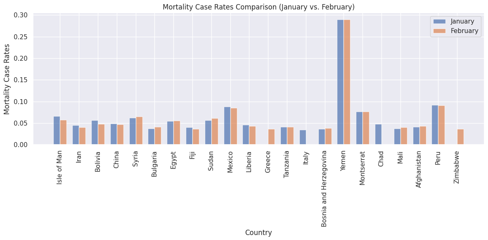
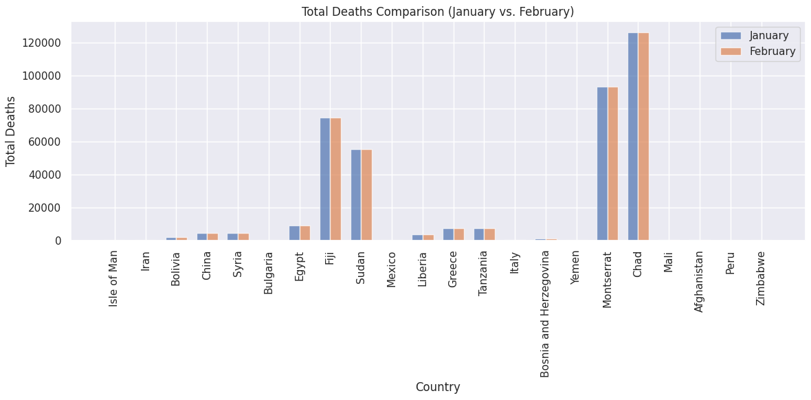
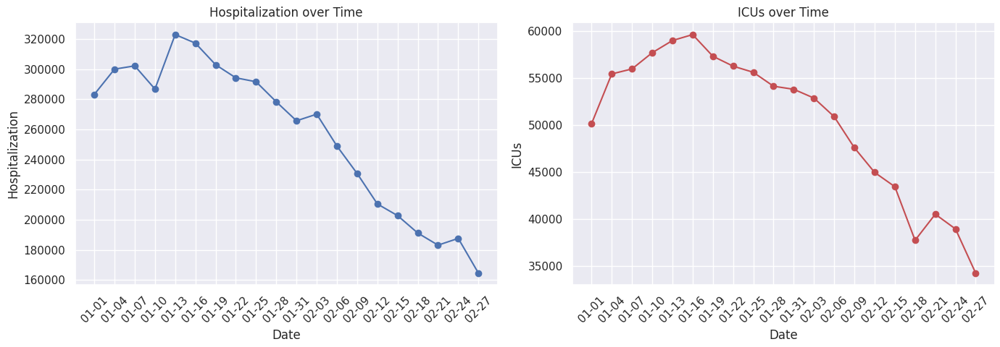
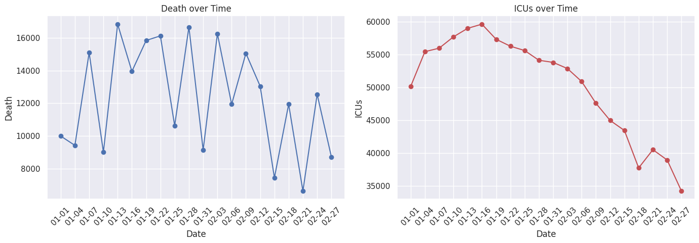
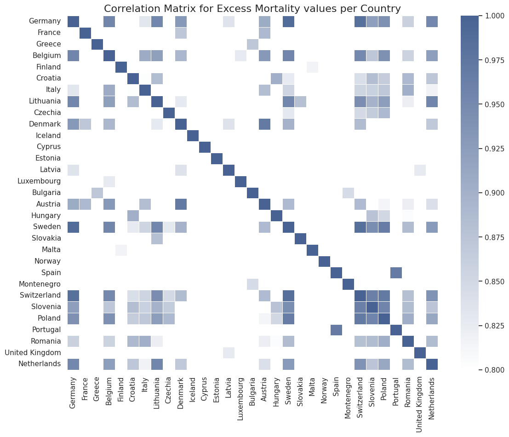

# DMB_PROJECT

Réalisé par Quentin LEGRAND et Bastien SAUVAT

## 💻 0. Prérequis

Pour lancer le Projet, ajoutez le fichiers **"./kill_match_stats_final_0.csv" et "./agg_match_stats_0.csv"** à la racine du projet.

Si vous décidez de lancer le script python, plutôt que le notebook, il est possible que certaines librairies soient à installer.

## 💻 1. Présentation du Projet

Ce projet porte sur le prétraitement et l'exploration de l'analyse des données du SARS-Cov-2 à l'échelle mondiale à l'aide de PySpark. Le jeu de données a été créé et est maintenu par Our World in Data (OWiD).

Avant de commencer l'analyse du dataset, nous allons effectuer certains nettoyages du dataset. Nous allons notamenent resteindre les dates du dataset à janvier et février 2021 pour réduire le temps d'éxecution. 

Durant cette analyse nous allons étudier le nombre de cas recensé, de nouveau test, l'évolution des taux de mortalité, l'évolution du nombre de patients admis en soins intensifs, la corrélation géographique de l'excès de mortalité, la corélation entre certains paramètres et la realtion entre le covid et l'état de santé.

## 💻 2. Visualisation du jeu de données

Commençons par visualiser le dataset :

```markdown
+--------+---------+-----------+----------+-----------+---------+------------------+------------+----------+-------------------+-----------------------+---------------------+------------------------------+------------------------+----------------------+-------------------------------+-----------------+------------+------------------------+-------------+-------------------------+---------------------+---------------------------------+----------------------+----------------------------------+-----------+---------+------------------------+----------------------+------------------+-------------------------------+-------------+--------------+-----------+------------------+-----------------+-----------------------+--------------+----------------+-------------------------+------------------------------+-----------------------------+-----------------------------------+--------------------------+-------------------------------------+------------------------------+------------------------------------------+----------------+-----------+------------------+----------+-------------+-------------+--------------+---------------+---------------------+-------------------+--------------+------------+----------------------+--------------------------+---------------+-----------------------+------------------------------------+---------------------------+----------------+---------------------------------------+
|iso_code|continent|   location|      date|total_cases|new_cases|new_cases_smoothed|total_deaths|new_deaths|new_deaths_smoothed|total_cases_per_million|new_cases_per_million|new_cases_smoothed_per_million|total_deaths_per_million|new_deaths_per_million|new_deaths_smoothed_per_million|reproduction_rate|icu_patients|icu_patients_per_million|hosp_patients|hosp_patients_per_million|weekly_icu_admissions|weekly_icu_admissions_per_million|weekly_hosp_admissions|weekly_hosp_admissions_per_million|total_tests|new_tests|total_tests_per_thousand|new_tests_per_thousand|new_tests_smoothed|new_tests_smoothed_per_thousand|positive_rate|tests_per_case|tests_units|total_vaccinations|people_vaccinated|people_fully_vaccinated|total_boosters|new_vaccinations|new_vaccinations_smoothed|total_vaccinations_per_hundred|people_vaccinated_per_hundred|people_fully_vaccinated_per_hundred|total_boosters_per_hundred|new_vaccinations_smoothed_per_million|new_people_vaccinated_smoothed|new_people_vaccinated_smoothed_per_hundred|stringency_index| population|population_density|median_age|aged_65_older|aged_70_older|gdp_per_capita|extreme_poverty|cardiovasc_death_rate|diabetes_prevalence|female_smokers|male_smokers|handwashing_facilities|hospital_beds_per_thousand|life_expectancy|human_development_index|excess_mortality_cumulative_absolute|excess_mortality_cumulative|excess_mortality|excess_mortality_cumulative_per_million|
+--------+---------+-----------+----------+-----------+---------+------------------+------------+----------+-------------------+-----------------------+---------------------+------------------------------+------------------------+----------------------+-------------------------------+-----------------+------------+------------------------+-------------+-------------------------+---------------------+---------------------------------+----------------------+----------------------------------+-----------+---------+------------------------+----------------------+------------------+-------------------------------+-------------+--------------+-----------+------------------+-----------------+-----------------------+--------------+----------------+-------------------------+------------------------------+-----------------------------+-----------------------------------+--------------------------+-------------------------------------+------------------------------+------------------------------------------+----------------+-----------+------------------+----------+-------------+-------------+--------------+---------------+---------------------+-------------------+--------------+------------+----------------------+--------------------------+---------------+-----------------------+------------------------------------+---------------------------+----------------+---------------------------------------+
|     AFG|     Asia|Afghanistan|2020-02-24|        5.0|      5.0|              NULL|        NULL|      NULL|               NULL|                  0.126|                0.126|                          NULL|                    NULL|                  NULL|                           NULL|             NULL|        NULL|                    NULL|         NULL|                     NULL|                 NULL|                             NULL|                  NULL|                              NULL|       NULL|     NULL|                    NULL|                  NULL|              NULL|                           NULL|         NULL|          NULL|       NULL|              NULL|             NULL|                   NULL|          NULL|            NULL|                     NULL|                          NULL|                         NULL|                               NULL|                      NULL|                                 NULL|                          NULL|                                      NULL|            8.33|3.9835428E7|            54.422|      18.6|        2.581|        1.337|      1803.987|           NULL|              597.029|               9.59|          NULL|        NULL|                37.746|                       0.5|          64.83|                  0.511|                                NULL|                       NULL|            NULL|                                   NULL|
|     AFG|     Asia|Afghanistan|2020-02-25|        5.0|      0.0|              NULL|        NULL|      NULL|               NULL|                  0.126|                  0.0|                          NULL|                    NULL|                  NULL|                           NULL|             NULL|        NULL|                    NULL|         NULL|                     NULL|                 NULL|                             NULL|                  NULL|                              NULL|       NULL|     NULL|                    NULL|                  NULL|              NULL|                           NULL|         NULL|          NULL|       NULL|              NULL|             NULL|                   NULL|          NULL|            NULL|                     NULL|                          NULL|                         NULL|                               NULL|                      NULL|                                 NULL|                          NULL|                                      NULL|            8.33|3.9835428E7|            54.422|      18.6|        2.581|        1.337|      1803.987|           NULL|              597.029|               9.59|          NULL|        NULL|                37.746|                       0.5|          64.83|                  0.511|                                NULL|                       NULL|            NULL|                                   NULL|
|     AFG|     Asia|Afghanistan|2020-02-26|        5.0|      0.0|              NULL|        NULL|      NULL|               NULL|                  0.126|                  0.0|                          NULL|                    NULL|                  NULL|                           NULL|             NULL|        NULL|                    NULL|         NULL|                     NULL|                 NULL|                             NULL|                  NULL|                              NULL|       NULL|     NULL|                    NULL|                  NULL|              NULL|                           NULL|         NULL|          NULL|       NULL|              NULL|             NULL|                   NULL|          NULL|            NULL|                     NULL|                          NULL|                         NULL|                               NULL|                      NULL|                                 NULL|                          NULL|                                      NULL|            8.33|3.9835428E7|            54.422|      18.6|        2.581|        1.337|      1803.987|           NULL|              597.029|               9.59|          NULL|        NULL|                37.746|                       0.5|          64.83|                  0.511|                                NULL|                       NULL|            NULL|                                   NULL|
|     AFG|     Asia|Afghanistan|2020-02-27|        5.0|      0.0|              NULL|        NULL|      NULL|               NULL|                  0.126|                  0.0|                          NULL|                    NULL|                  NULL|                           NULL|             NULL|        NULL|                    NULL|         NULL|                     NULL|                 NULL|                             NULL|                  NULL|                              NULL|       NULL|     NULL|                    NULL|                  NULL|              NULL|                           NULL|         NULL|          NULL|       NULL|              NULL|             NULL|                   NULL|          NULL|            NULL|                     NULL|                          NULL|                         NULL|                               NULL|                      NULL|                                 NULL|                          NULL|                                      NULL|            8.33|3.9835428E7|            54.422|      18.6|        2.581|        1.337|      1803.987|           NULL|              597.029|               9.59|          NULL|        NULL|                37.746|                       0.5|          64.83|                  0.511|                                NULL|                       NULL|            NULL|                                   NULL|
|     AFG|     Asia|Afghanistan|2020-02-28|        5.0|      0.0|              NULL|        NULL|      NULL|               NULL|                  0.126|                  0.0|                          NULL|                    NULL|                  NULL|                           NULL|             NULL|        NULL|                    NULL|         NULL|                     NULL|                 NULL|                             NULL|                  NULL|                              NULL|       NULL|     NULL|                    NULL|                  NULL|              NULL|                           NULL|         NULL|          NULL|       NULL|              NULL|             NULL|                   NULL|          NULL|            NULL|                     NULL|                          NULL|                         NULL|                               NULL|                      NULL|                                 NULL|                          NULL|                                      NULL|            8.33|3.9835428E7|            54.422|      18.6|        2.581|        1.337|      1803.987|           NULL|              597.029|               9.59|          NULL|        NULL|                37.746|                       0.5|          64.83|                  0.511|                                NULL|                       NULL|            NULL|                                   NULL|
+--------+---------+-----------+----------+-----------+---------+------------------+------------+----------+-------------------+-----------------------+---------------------+------------------------------+------------------------+----------------------+-------------------------------+-----------------+------------+------------------------+-------------+-------------------------+---------------------+---------------------------------+----------------------+----------------------------------+-----------+---------+------------------------+----------------------+------------------+-------------------------------+-------------+--------------+-----------+------------------+-----------------+-----------------------+--------------+----------------+-------------------------+------------------------------+-----------------------------+-----------------------------------+--------------------------+-------------------------------------+------------------------------+------------------------------------------+----------------+-----------+------------------+----------+-------------+-------------+--------------+---------------+---------------------+-------------------+--------------+------------+----------------------+--------------------------+---------------+-----------------------+------------------------------------+---------------------------+----------------+---------------------------------------+
only showing top 5 rows
```

Ce dataset est très complet et contient des informations allant des statistiques du Covid (cas,test,admissions hebdommadaire..) aux informations démographiques et médicales du pays. Voici une liste exhaustive :

```markdown
root
 |-- iso_code: string (nullable = true)
 |-- continent: string (nullable = true)
 |-- location: string (nullable = true)
 |-- date: date (nullable = true)
 |------------------------ Statistiques Covid ------------------------
 |-- total_cases: double (nullable = true)
 |-- new_cases: double (nullable = true)
 |-- new_cases_smoothed: double (nullable = true)
 |-- total_deaths: double (nullable = true)
 |-- new_deaths: double (nullable = true)
 |-- new_deaths_smoothed: double (nullable = true)
 |-- total_cases_per_million: double (nullable = true)
 |-- new_cases_per_million: double (nullable = true)
 |-- new_cases_smoothed_per_million: double (nullable = true)
 |-- total_deaths_per_million: double (nullable = true)
 |-- new_deaths_per_million: double (nullable = true)
 |-- new_deaths_smoothed_per_million: double (nullable = true)
 |-- reproduction_rate: double (nullable = true)
  |---------------- Hospitalisation/Vaccination ----------------------
 |-- icu_patients: double (nullable = true)
 |-- icu_patients_per_million: double (nullable = true)
 |-- hosp_patients: double (nullable = true)
 |-- hosp_patients_per_million: double (nullable = true)
 |-- weekly_icu_admissions: double (nullable = true)
 |-- weekly_icu_admissions_per_million: double (nullable = true)
 |-- weekly_hosp_admissions: double (nullable = true)
 |-- weekly_hosp_admissions_per_million: double (nullable = true)
 |-- total_tests: double (nullable = true)
 |-- new_tests: double (nullable = true)
 |-- total_tests_per_thousand: double (nullable = true)
 |-- new_tests_per_thousand: double (nullable = true)
 |-- new_tests_smoothed: double (nullable = true)
 |-- new_tests_smoothed_per_thousand: double (nullable = true)
 |-- positive_rate: double (nullable = true)
 |-- tests_per_case: double (nullable = true)
 |-- tests_units: string (nullable = true)
 |-- total_vaccinations: double (nullable = true)
 |-- people_vaccinated: double (nullable = true)
 |-- people_fully_vaccinated: double (nullable = true)
 |-- total_boosters: double (nullable = true)
 |-- new_vaccinations: double (nullable = true)
 |-- new_vaccinations_smoothed: double (nullable = true)
 |-- total_vaccinations_per_hundred: double (nullable = true)
 |-- people_vaccinated_per_hundred: double (nullable = true)
 |-- people_fully_vaccinated_per_hundred: double (nullable = true)
 |-- total_boosters_per_hundred: double (nullable = true)
 |-- new_vaccinations_smoothed_per_million: double (nullable = true)
 |-- new_people_vaccinated_smoothed: double (nullable = true)
 |-- new_people_vaccinated_smoothed_per_hundred: double (nullable = true)
 |-- stringency_index: double (nullable = true)
 |------------------ Informations démograpghique --------------------------
 |-- population: double (nullable = true)
 |-- population_density: double (nullable = true)
 |-- median_age: double (nullable = true)
 |-- aged_65_older: double (nullable = true)
 |-- aged_70_older: double (nullable = true)
 |-- gdp_per_capita: double (nullable = true)
 |-- extreme_poverty: double (nullable = true)
|------------------ Informations médicales --------------------------------
 |-- cardiovasc_death_rate: double (nullable = true)
 |-- diabetes_prevalence: double (nullable = true)
 |-- female_smokers: double (nullable = true)
 |-- male_smokers: double (nullable = true)
 |-- handwashing_facilities: double (nullable = true)
 |-- hospital_beds_per_thousand: double (nullable = true)
 |-- life_expectancy: double (nullable = true)
 |-- human_development_index: double (nullable = true)
 |-- excess_mortality_cumulative_absolute: double (nullable = true)
 |-- excess_mortality_cumulative: double (nullable = true)
 |-- excess_mortality: double (nullable = true)
 |-- excess_mortality_cumulative_per_million: double (nullable = true)
```

## 💻 3. Nettoyage du dataset

Comme évoqué précédement, nous allons commencer par restreindre le dataset à la période de janvier à février 2021.

```markdown
The number of samples is now 13515 against the previous 176224.
```

Ensuite nous avons vérifier la présence d'éventuelles de valeurs NULL :

```markdown
| weekly_icu_admissions | weekly_icu_admissions_per_million | excess_mortality_cumulative_absolute | excess_mortality_cumulative | excess_mortality | excess_mortality_cumulative_per_million | total_boosters | total_boosters_per_hundred | weekly_hosp_admissions | weekly_hosp_admissions_per_million | ... | new_cases_smoothed_per_million | new_cases_per_million | total_cases_per_million | new_cases_smoothed | new_cases | total_cases | population | iso_code | location | date |
|------------------------|-----------------------------------|------------------------------------|---------------------------|------------------|-----------------------------------------|----------------|---------------------------|------------------------|--------------------------------------|-----|--------------------------------|-----------------------|-----------------------|-------------------|-------------|-----------------------|-----------|----------|----------|------|
| 13029                  | 13029                             | 13010                              | 13010                     | 13010            | 13010                                   | 12765          | 12765                     | 12581                  | 12581                                | ... | 412                            | 382                   | 378                   | 353               | 323         | 319         | 105       | 0        | 0        | 0    |

1 rows × 67 columns
```

Pour adresser cette situation nous avons remplacé les valeurs de noms de continent par "Unknown", les types de test par "no info" et les valeurs numériques par 0.

D'autre part, nous avons supprimé les possibles doublons et avons retiré certains "pays". Les pays concerné sont par exemple "Le Monde", "L'Union Européene","L'Asie" ou encore les "pays à haut revenu". Ces éléments pourrait permettre de faire des analyses intéressantes mais nous allons nous contenter des pays "classiquesé.

## 💻 4. Etude du nombre de cas (Facile)

```markdown
During 2021-01-01, the top 20 countries with the highest number of total_cases were:
▶ United States , with 20370964 total_cases.
▶ India         , with 10305788 total_cases.
▶ Brazil        , with 7703971 total_cases.
▶ Russia        , with 3153960 total_cases.
▶ France        , with 2680034 total_cases.
▶ United Kingdom, with 2545102 total_cases.
▶ Turkey        , with 2220855 total_cases.
▶ Italy         , with 2129376 total_cases.
▶ Spain         , with 1928265 total_cases.
▶ Germany       , with 1742661 total_cases.
▶ Colombia      , with 1654880 total_cases.
▶ Argentina     , with 1629594 total_cases.
▶ Mexico        , with 1437185 total_cases.
▶ Poland        , with 1305774 total_cases.
▶ Iran          , with 1231429 total_cases.
▶ Ukraine       , with 1096855 total_cases.
▶ South Africa  , with 1073887 total_cases.
▶ Peru          , with 1015137 total_cases.
▶ Netherlands   , with 815223 total_cases.
▶ Indonesia     , with 751270 total_cases.

During 2021-01-01, the top 20 countries with the highest number of total_cases were:
▶ United States , with 26464042 total_cases.
▶ India         , with 10766245 total_cases.
▶ Brazil        , with 9237011 total_cases.
▶ United Kingdom, with 3839472 total_cases.
▶ Russia        , with 3825739 total_cases.
▶ France        , with 3242205 total_cases.
▶ Spain         , with 2822805 total_cases.
▶ Italy         , with 2560957 total_cases.
▶ Turkey        , with 2485182 total_cases.
▶ Germany       , with 2221971 total_cases.
▶ Colombia      , with 2104506 total_cases.
▶ Argentina     , with 1933853 total_cases.
▶ Mexico        , with 1869708 total_cases.
▶ Poland        , with 1515889 total_cases.
▶ South Africa  , with 1456309 total_cases.
▶ Iran          , with 1424596 total_cases.
▶ Ukraine       , with 1263833 total_cases.
▶ Peru          , with 1138239 total_cases.
▶ Indonesia     , with 1089308 total_cases.
▶ Czechia       , with 987329 total_cases.

Modification in total cases Rankings between January and February:
Russia        : ↓ Moved down by 1 position(s) from 4 to 5
France        : ↓ Moved down by 1 position(s) from 5 to 6
United Kingdom: ↑ Moved up by 2 position(s) from 6 to 4
Turkey        : ↓ Moved down by 2 position(s) from 7 to 9
Spain         : ↑ Moved up by 2 position(s) from 9 to 7
Iran          : ↓ Moved down by 1 position(s) from 15 to 16
Ukraine       : ↓ Moved down by 1 position(s) from 16 to 17
South Africa  : ↑ Moved up by 2 position(s) from 17 to 15
Netherlands   : No longer in February Top 20
Indonesia     : ↑ Moved up by 1 position(s) from 20 to 19
Czechia       : New entry at position 20
```

## 💻 5. Etude du nombre de nouveau test (Facile)

```markdown
During 2021-01-01, the top 20 countries with the highest number of new_tests were:
▶ United States       , with 1257252 new_tests.
▶ India               , with 1062420 new_tests.
▶ United Kingdom      , with 404917 new_tests.
▶ Russia              , with 386001 new_tests.
▶ Turkey              , with 158103 new_tests.
▶ Italy               , with 157524 new_tests.
▶ United Arab Emirates, with 145163 new_tests.
▶ Canada              , with 132528 new_tests.
▶ South Korea         , with 101176 new_tests.
▶ Israel              , with 95925 new_tests.
▶ Australia           , with 56346 new_tests.
▶ Spain               , with 53318 new_tests.
▶ Chile               , with 50583 new_tests.
▶ South Africa        , with 50110 new_tests.
▶ Iran                , with 49601 new_tests.
▶ Pakistan            , with 41039 new_tests.
▶ Malaysia            , with 39641 new_tests.
▶ Colombia            , with 38942 new_tests.
▶ Netherlands         , with 33272 new_tests.
▶ France              , with 33219 new_tests.

During 2021-01-01, the top 20 countries with the highest number of new_tests were:
▶ United States       , with 1038752 new_tests.
▶ United Kingdom      , with 658861 new_tests.
▶ India               , with 504263 new_tests.
▶ France              , with 441380 new_tests.
▶ Spain               , with 251059 new_tests.
▶ Slovakia            , with 202429 new_tests.
▶ Russia              , with 201301 new_tests.
▶ Italy               , with 142419 new_tests.
▶ Turkey              , with 141703 new_tests.
▶ Denmark             , with 130182 new_tests.
▶ United Arab Emirates, with 127572 new_tests.
▶ Austria             , with 126053 new_tests.
▶ Canada              , with 102060 new_tests.
▶ Israel              , with 89833 new_tests.
▶ Czechia             , with 84375 new_tests.
▶ Japan               , with 67269 new_tests.
▶ Chile               , with 58709 new_tests.
▶ Colombia            , with 57773 new_tests.
▶ Argentina           , with 54996 new_tests.
▶ Iran                , with 54971 new_tests.

Modification in total cases Rankings between January and February:
India               : ↓ Moved down by 1 position(s) from 2 to 3
United Kingdom      : ↑ Moved up by 1 position(s) from 3 to 2
Russia              : ↓ Moved down by 3 position(s) from 4 to 7
Turkey              : ↓ Moved down by 4 position(s) from 5 to 9
Italy               : ↓ Moved down by 2 position(s) from 6 to 8
United Arab Emirates: ↓ Moved down by 4 position(s) from 7 to 11
Canada              : ↓ Moved down by 5 position(s) from 8 to 13
South Korea         : No longer in February Top 20
Israel              : ↓ Moved down by 4 position(s) from 10 to 14
Australia           : No longer in February Top 20
Spain               : ↑ Moved up by 7 position(s) from 12 to 5
Chile               : ↓ Moved down by 4 position(s) from 13 to 17
South Africa        : No longer in February Top 20
Iran                : ↓ Moved down by 5 position(s) from 15 to 20
Pakistan            : No longer in February Top 20
Malaysia            : No longer in February Top 20
Netherlands         : No longer in February Top 20
France              : ↑ Moved up by 16 position(s) from 20 to 4
Japan               : New entry at position 16
Austria             : New entry at position 12
Slovakia            : New entry at position 6
Argentina           : New entry at position 19
Czechia             : New entry at position 15
Denmark             : New entry at position 10
```

A l'inverse des TOP des nombres de cas positifs au COVID, on se rend compte avec les test que les évolutions sont bien plus brusques ce qui pourrait traduire de la prise de conscience des populations de se tester où le résultat des obligations gouvernementales en terme test.

## 💻 6. Etude de l'évolution du taux de mortalité dans les pays (Intermédiaire)

Nous allons commencer par étudier la mortalité du COVID, c'est à dire le rapport du nombre de morts sur le nombre de cas.

```markdown
During 2021-01-01, the top 20 countries with the highest number of mortality_per_case were:
▶ Yemen                 , with 29.03% of mortality_per_case.
▶ Peru                  , with 9.18% of mortality_per_case.
▶ Mexico                , with 8.80% of mortality_per_case.
▶ Montserrat            , with 7.69% of mortality_per_case.
▶ Isle of Man           , with 6.63% of mortality_per_case.
▶ Ecuador               , with 6.59% of mortality_per_case.
▶ Syria                 , with 6.22% of mortality_per_case.
▶ Sudan                 , with 5.71% of mortality_per_case.
▶ Bolivia               , with 5.70% of mortality_per_case.
▶ Egypt                 , with 5.51% of mortality_per_case.
▶ China                 , with 4.94% of mortality_per_case.
▶ Chad                  , with 4.86% of mortality_per_case.
▶ Liberia               , with 4.61% of mortality_per_case.
▶ Iran                  , with 4.49% of mortality_per_case.
▶ Afghanistan           , with 4.19% of mortality_per_case.
▶ Tanzania              , with 4.13% of mortality_per_case.
▶ Fiji                  , with 4.08% of mortality_per_case.
▶ Mali                  , with 3.76% of mortality_per_case.
▶ Bulgaria              , with 3.75% of mortality_per_case.
▶ Bosnia and Herzegovina, with 3.64% of mortality_per_case.

During 2021-01-01, the top 20 countries with the highest number of mortality_per_case were:
▶ Yemen                 , with 28.98% of mortality_per_case.
▶ Peru                  , with 9.16% of mortality_per_case.
▶ Mexico                , with 8.51% of mortality_per_case.
▶ Montserrat            , with 7.69% of mortality_per_case.
▶ Syria                 , with 6.57% of mortality_per_case.
▶ Sudan                 , with 6.15% of mortality_per_case.
▶ Ecuador               , with 5.93% of mortality_per_case.
▶ Isle of Man           , with 5.76% of mortality_per_case.
▶ Egypt                 , with 5.62% of mortality_per_case.
▶ Bolivia               , with 4.78% of mortality_per_case.
▶ China                 , with 4.76% of mortality_per_case.
▶ Afghanistan           , with 4.37% of mortality_per_case.
▶ Liberia               , with 4.33% of mortality_per_case.
▶ Bulgaria              , with 4.16% of mortality_per_case.
▶ Tanzania              , with 4.13% of mortality_per_case.
▶ Mali                  , with 4.07% of mortality_per_case.
▶ Iran                  , with 4.07% of mortality_per_case.
▶ Bosnia and Herzegovina, with 3.87% of mortality_per_case.
▶ Greece                , with 3.70% of mortality_per_case.
▶ Zimbabwe              , with 3.68% of mortality_per_case.

Modification in total cases Rankings between January and February:
Isle of Man           : ↓ Moved down by 3 position(s) from 5 to 8
Ecuador               : ↓ Moved down by 1 position(s) from 6 to 7
Syria                 : ↑ Moved up by 2 position(s) from 7 to 5
Sudan                 : ↑ Moved up by 2 position(s) from 8 to 6
Bolivia               : ↓ Moved down by 1 position(s) from 9 to 10
Egypt                 : ↑ Moved up by 1 position(s) from 10 to 9
Chad                  : No longer in February Top 20
Iran                  : ↓ Moved down by 3 position(s) from 14 to 17
Afghanistan           : ↑ Moved up by 3 position(s) from 15 to 12
Tanzania              : ↑ Moved up by 1 position(s) from 16 to 15
Fiji                  : No longer in February Top 20
Mali                  : ↑ Moved up by 2 position(s) from 18 to 16
Bulgaria              : ↑ Moved up by 5 position(s) from 19 to 14
Bosnia and Herzegovina: ↑ Moved up by 2 position(s) from 20 to 18
Greece                : New entry at position 19
Zimbabwe              : New entry at position 20
```

Le taux de mortalité au Yemen semble excessif face au reste du classement (29% face à 9% pour le 2nd). Après vérification sur la page wikipédia correspondante, il semblerait que le nombre de mort au Yemen était bien de 650 morts pour 2200 cas en février 2021.

Ensuite nous allons étudier le taux de mortalité du pays, c'est à dire le rapport de nombre de morts sur le nombre d'habitants.

```markdown
During 2021-01-01, the top 20 countries with the highest number of mortality_per_pop were:
▶ Peru                  , with 0.28% of mortality_per_pop.
▶ San Marino            , with 0.17% of mortality_per_pop.
▶ Belgium               , with 0.17% of mortality_per_pop.
▶ Slovenia              , with 0.13% of mortality_per_pop.
▶ Bosnia and Herzegovina, with 0.13% of mortality_per_pop.
▶ Italy                 , with 0.12% of mortality_per_pop.
▶ North Macedonia       , with 0.12% of mortality_per_pop.
▶ Liechtenstein         , with 0.12% of mortality_per_pop.
▶ Bulgaria              , with 0.11% of mortality_per_pop.
▶ Czechia               , with 0.11% of mortality_per_pop.
▶ Montenegro            , with 0.11% of mortality_per_pop.
▶ United Kingdom        , with 0.11% of mortality_per_pop.
▶ Spain                 , with 0.11% of mortality_per_pop.
▶ Andorra               , with 0.11% of mortality_per_pop.
▶ United States         , with 0.11% of mortality_per_pop.
▶ Hungary               , with 0.10% of mortality_per_pop.
▶ Mexico                , with 0.10% of mortality_per_pop.
▶ Croatia               , with 0.10% of mortality_per_pop.
▶ France                , with 0.10% of mortality_per_pop.
▶ Armenia               , with 0.10% of mortality_per_pop.

During 2021-01-01, the top 20 countries with the highest number of mortality_per_pop were:
▶ Peru                  , with 0.31% of mortality_per_pop.
▶ Gibraltar             , with 0.23% of mortality_per_pop.
▶ San Marino            , with 0.20% of mortality_per_pop.
▶ Belgium               , with 0.18% of mortality_per_pop.
▶ Slovenia              , with 0.17% of mortality_per_pop.
▶ United Kingdom        , with 0.16% of mortality_per_pop.
▶ Czechia               , with 0.15% of mortality_per_pop.
▶ Italy                 , with 0.15% of mortality_per_pop.
▶ Bosnia and Herzegovina, with 0.14% of mortality_per_pop.
▶ Liechtenstein         , with 0.14% of mortality_per_pop.
▶ North Macedonia       , with 0.14% of mortality_per_pop.
▶ United States         , with 0.14% of mortality_per_pop.
▶ Bulgaria              , with 0.13% of mortality_per_pop.
▶ Andorra               , with 0.13% of mortality_per_pop.
▶ Hungary               , with 0.13% of mortality_per_pop.
▶ Montenegro            , with 0.13% of mortality_per_pop.
▶ Spain                 , with 0.13% of mortality_per_pop.
▶ Portugal              , with 0.13% of mortality_per_pop.
▶ Croatia               , with 0.12% of mortality_per_pop.
▶ Mexico                , with 0.12% of mortality_per_pop.

Modification in total cases Rankings between January and February:
San Marino            : ↓ Moved down by 1 position(s) from 2 to 3
Belgium               : ↓ Moved down by 1 position(s) from 3 to 4
Slovenia              : ↓ Moved down by 1 position(s) from 4 to 5
Bosnia and Herzegovina: ↓ Moved down by 4 position(s) from 5 to 9
Italy                 : ↓ Moved down by 2 position(s) from 6 to 8
North Macedonia       : ↓ Moved down by 4 position(s) from 7 to 11
Liechtenstein         : ↓ Moved down by 2 position(s) from 8 to 10
Bulgaria              : ↓ Moved down by 4 position(s) from 9 to 13
Czechia               : ↑ Moved up by 3 position(s) from 10 to 7
Montenegro            : ↓ Moved down by 5 position(s) from 11 to 16
United Kingdom        : ↑ Moved up by 6 position(s) from 12 to 6
Spain                 : ↓ Moved down by 4 position(s) from 13 to 17
United States         : ↑ Moved up by 3 position(s) from 15 to 12
Hungary               : ↑ Moved up by 1 position(s) from 16 to 15
Mexico                : ↓ Moved down by 3 position(s) from 17 to 20
Croatia               : ↓ Moved down by 1 position(s) from 18 to 19
France                : No longer in February Top 20
Armenia               : No longer in February Top 20
Portugal              : New entry at position 18
Gibraltar             : New entry at position 2
```

Pour se donner une idée de ce que ces taux de mortalité représente nous avons afficher ses taux dans un histogramme, ainsi que le nombre de morts.





## 💻 7. Etude de l'évolution du nombre de patients (Intermédiaire)

```markdown
During 2021-01-01, the top 20 countries with the highest number of icu_patients were:
▶ United States , with 27471 icu_patients.
▶ Germany       , with 5604 icu_patients.
▶ France        , with 2609 icu_patients.
▶ Italy         , with 2553 icu_patients.
▶ United Kingdom, with 2162 icu_patients.
▶ Spain         , with 2085 icu_patients.
▶ Czechia       , with 952 icu_patients.
▶ Canada        , with 817 icu_patients.
▶ Chile         , with 794 icu_patients.
▶ Netherlands   , with 703 icu_patients.
▶ Belgium       , with 489 icu_patients.
▶ Portugal      , with 483 icu_patients.
▶ Bulgaria      , with 464 icu_patients.
▶ Switzerland   , with 421 icu_patients.
▶ Austria       , with 385 icu_patients.
▶ South Korea   , with 354 icu_patients.
▶ Sweden        , with 335 icu_patients.
▶ Serbia        , with 283 icu_patients.
▶ Slovakia      , with 245 icu_patients.
▶ Israel        , with 225 icu_patients.

During 2021-01-01, the top 20 countries with the highest number of icu_patients were:
▶ United States , with 22230 icu_patients.
▶ Spain         , with 4853 icu_patients.
▶ Germany       , with 4322 icu_patients.
▶ United Kingdom, with 3726 icu_patients.
▶ Argentina     , with 3554 icu_patients.
▶ France        , with 3218 icu_patients.
▶ Italy         , with 2252 icu_patients.
▶ Chile         , with 1456 icu_patients.
▶ Czechia       , with 1078 icu_patients.
▶ Portugal      , with 865 icu_patients.
▶ Canada        , with 819 icu_patients.
▶ Netherlands   , with 639 icu_patients.
▶ Malaysia      , with 414 icu_patients.
▶ Israel        , with 398 icu_patients.
▶ Slovakia      , with 341 icu_patients.
▶ Belgium       , with 325 icu_patients.
▶ Austria       , with 294 icu_patients.
▶ Switzerland   , with 284 icu_patients.
▶ Bulgaria      , with 264 icu_patients.
▶ Sweden        , with 248 icu_patients.

Modification in total cases Rankings between January and February:
Germany       : ↓ Moved down by 1 position(s) from 2 to 3
France        : ↓ Moved down by 3 position(s) from 3 to 6
Italy         : ↓ Moved down by 3 position(s) from 4 to 7
United Kingdom: ↑ Moved up by 1 position(s) from 5 to 4
Spain         : ↑ Moved up by 4 position(s) from 6 to 2
Czechia       : ↓ Moved down by 2 position(s) from 7 to 9
Canada        : ↓ Moved down by 3 position(s) from 8 to 11
Chile         : ↑ Moved up by 1 position(s) from 9 to 8
Netherlands   : ↓ Moved down by 2 position(s) from 10 to 12
Belgium       : ↓ Moved down by 5 position(s) from 11 to 16
Portugal      : ↑ Moved up by 2 position(s) from 12 to 10
Bulgaria      : ↓ Moved down by 6 position(s) from 13 to 19
Switzerland   : ↓ Moved down by 4 position(s) from 14 to 18
Austria       : ↓ Moved down by 2 position(s) from 15 to 17
South Korea   : No longer in February Top 20
Sweden        : ↓ Moved down by 3 position(s) from 17 to 20
Serbia        : No longer in February Top 20
Slovakia      : ↑ Moved up by 4 position(s) from 19 to 15
Israel        : ↑ Moved up by 6 position(s) from 20 to 14
Argentina     : New entry at position 5
Malaysia      : New entry at position 13
```





## 💻8. Etude de la Corrélation de l'excès de mortalité (Difficile)



## 💻9. Etude de la Corrélation entre différente features (Difficile)

```markdown
As far as the correlation between new tests and excess mortality is concerned:

The ten countries with the highest correlation are:
Spain, with correlation equal to 0.976.
South Africa, with correlation equal to 0.968.
Peru, with correlation equal to 0.962.
Portugal, with correlation equal to 0.960.
Mexico, with correlation equal to 0.921.
Colombia, with correlation equal to 0.916.
United States, with correlation equal to 0.794.
Lithuania, with correlation equal to 0.762.
South Korea, with correlation equal to 0.723.
Chile, with correlation equal to 0.647.

The ten countries with the lowest correlation are:
Slovakia, with correlation equal to -0.883.
Denmark, with correlation equal to -0.828.
Romania, with correlation equal to -0.762.
New Zealand, with correlation equal to -0.729.
Switzerland, with correlation equal to -0.715.
Italy, with correlation equal to -0.698.
Sweden, with correlation equal to -0.643.
Luxembourg, with correlation equal to -0.543.
Guatemala, with correlation equal to -0.483.
Austria, with correlation equal to -0.396.
```

## 💻10. Etude de la relation entre Covid et conditions générales de santé (Difficile)

```markdown
Based on data up to 2021-01-01, the mean percentage of female smokers is 10.49%, while the corresponding number for male smokers is 32.82%.
In addition, the mean percentage of people suffering from diabetes (aged 20-79) is 8.27%, while the mean number of deaths per 100.000 people due to cardiovascular conditions is 263.33.
```

```markdown
| location | excess_mortality_cumulative_per_million | female_smokers | male_smokers | diabetes_prevalence | cardiovasc_death_rate |
|----------|----------------------------------------|----------------|--------------|---------------------|------------------------|
| Armenia  | 3613.725554                            | 1.5            | 52.1         | 7.11                | 341.010                |
| Mexico   | 3437.694368                            | 6.9            | 21.4         | 13.06               | 152.783                |
| Belarus  | 3287.984465                            | 10.5           | 46.1         | 5.18                | 443.129                |
| Russia   | 3151.540865                            | 23.4           | 58.3         | 6.18                | 431.297                |
| Albania  | 2854.503445                            | 7.1            | 51.2         | 10.08               | 304.195                |
```

```markdown
| location | Female Smokers (%) | Male Smokers (%) | Diabetic Population (%) | Cardiovascular-related Deaths per 100.000 (%) |
|----------|---------------------|------------------|--------------------------|---------------------------------------------|
| Armenia  | -8.99               | **19.28**        | -1.17                    | **77.03**                                   |
| Mexico   | -3.59               | -11.42           | **4.78**                 | -111.19                                     |
| Belarus  | **0.01**            | **13.28**        | -3.10                    | **179.15**                                  |
| Russia   | **12.91**           | **25.48**        | -2.10                    | **167.32**                                  |
| Albania  | -3.39               | **18.38**        | **1.80**                 | **40.22**                                   |
```

```markdown
| location   | Excess Mortality (per million) | Female Smokers (%) | Male Smokers (%) | Diabetes Prevalence (%) | Cardiovascular Death Rate |
|------------|--------------------------------|--------------------|------------------|-------------------------|---------------------------|
| Seychelles | -1678.29                   | 7.1                | 35.7             | 10.55                   | 242.648                   |
| Barbados   | -832.09                    | 1.9                | 14.5             | 13.57                   | 170.050                   |
| Uruguay    | -682.38                    | 14.0               | 19.9             | 6.93                    | 160.708                   |
| Mongolia   | -605.84                    | 5.5                | 46.5             | 4.82                    | 460.043                   |
| Malaysia   | -465.23                   | 1.0                | 42.4             | 16.74                   | 260.942                   |
```


| location   | Female Smokers (%) | Male Smokers (%) | Diabetic Population (%) | Cardiovascular-related Deaths per 100.000 (%) |
|------------|---------------------|-------------------|-------------------------|--------------------------------------------------|
| Seychelles | -3.39           | **2.88**               | **2.27**                         | -21.33                                                  |
| Barbados    | -8.59               | -18.32            | **5.29**                         | -93.93                                                  |
| Uruguay       | **3.51**                  | -12.92            | -1.35                        | -103.27                                                |
| Mongolia    | -4.99            | **13.68**               | -3.46                       | **196.07**                                                  |
| Malaysia    | -9.49            | **9.58**                | **8.46**                         | -3.03                                                    |
